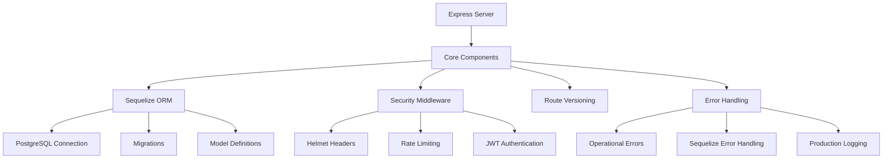

# PupilSync Server Architecture (Updated for PostgreSQL)

## Overview
Production-grade Express.js API server following modern best practices with:
- JWT authentication flow
- PostgreSQL database integration
- Comprehensive security measures
- Automated testing suite



## Updated Dependencies
| Package | Purpose |
|---------|---------|
| Sequelize | PostgreSQL ORM |
| pg | PostgreSQL client |
| jest | Test framework |
| supertest | HTTP assertions |

## Testing Strategy
- 100% endpoint coverage
- Database transaction rollbacks
- Security test cases
- Error scenario testing

To run tests:
```bash
npm test