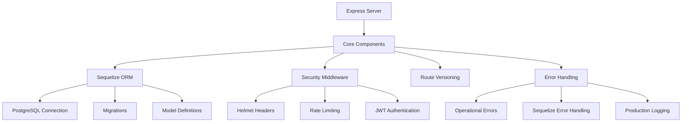
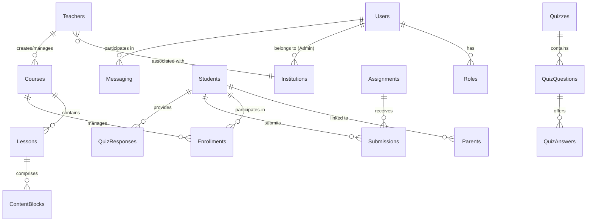

# PupilSync Server Architecture (Updated for PostgreSQL)

## Overview
Production-grade Express.js API server following modern best practices with:
- JWT authentication flow
- PostgreSQL database integration
- Comprehensive security measures
- Automated testing suite



## Package Dependencies

### Runtime Dependencies
| Package | Purpose |
|---------|---------|
| bcryptjs | Password hashing |
| compression | Response compression middleware |
| cookie-parser | Cookie parsing middleware |
| cors | Cross-Origin Resource Sharing middleware |
| dotenv | Environment variable loader |
| express | Web application framework |
| express-rate-limit | Request rate limiting |
| express-validator | Request validation middleware |
| helmet | Security HTTP headers |
| http-status-codes | HTTP status code constants |
| jsonwebtoken | JWT implementation |
| morgan | HTTP request logger |
| passport | Authentication middleware |
| passport-jwt | JWT strategy for Passport |
| pg | PostgreSQL client |
| pg-hstore | PostgreSQL hstore support |
| sequelize | PostgreSQL ORM |
| validator | String validation library |
| winston | Logging library |
| winston-daily-rotate-file | Rotating file transport for Winston |

### Development Dependencies
| Package | Purpose |
|---------|---------|
| cross-env | Cross-platform environment variables |
| jest | Testing framework |
| nodemon | Development server reloading |
| sequelize-cli | Sequelize CLI tools |
| supertest | HTTP assertion testing |

## Core Domain Model

### Key Entities
- **Users**: Central authentication entity with role-based access
- **Roles**: Student, Teacher, Admin (Institution), Parent
- **Institutions**: Schools/coaching centers using the platform
- **Teachers**: Create/manage courses, can be independent or institution-linked
- **Students**: Consume content and participate in courses
- **Parents**: Monitor linked students' progress
- **Courses**: Primary learning content containers
- **Enrollments**: Link Students to Courses/Teachers/Institutions
- **Lessons**: Individual learning units within Courses
- **Content Blocks**: Modular pieces (Text/Video/Quiz/Assignment) using JSONB
- **Assignments**: Student tasks with submission requirements
- **Submissions**: Student work deliverables
- **Quizzes**: Knowledge assessment tools
- **Quiz Questions**: Individual test items
- **Quiz Answers**: Multiple-choice options
- **Quiz Responses**: Student answer records
- **Messaging**: User communication system



## Testing Strategy
- 100% endpoint coverage
- Database transaction rollbacks
- Security test cases
- Error scenario testing

To run tests:
```bash
npm test