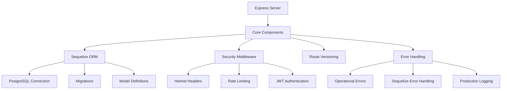
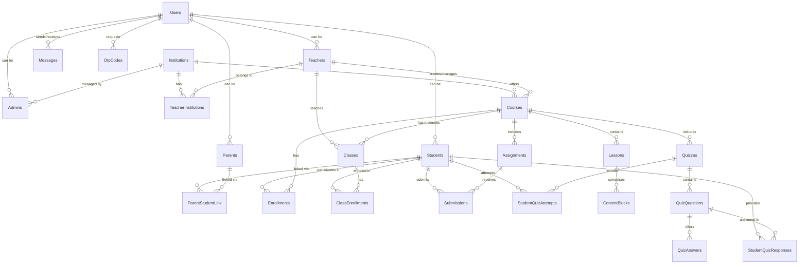

# PupilSync Server Architecture (Updated for PostgreSQL)

## Overview
Production-grade Express.js API server following modern best practices with:
- JWT authentication flow
- PostgreSQL database integration
- Comprehensive security measures
- Automated testing suite



## Package Dependencies

### Runtime Dependencies
| Package | Purpose |
|---------|---------|
| bcryptjs | Password hashing |
| compression | Response compression middleware |
| cookie-parser | Cookie parsing middleware |
| cors | Cross-Origin Resource Sharing middleware |
| dotenv | Environment variable loader |
| express | Web application framework |
| express-rate-limit | Request rate limiting |
| express-validator | Request validation middleware |
| helmet | Security HTTP headers |
| http-status-codes | HTTP status code constants |
| jsonwebtoken | JWT implementation |
| morgan | HTTP request logger |
| passport | Authentication middleware |
| passport-jwt | JWT strategy for Passport |
| pg | PostgreSQL client |
| pg-hstore | PostgreSQL hstore support |
| sequelize | PostgreSQL ORM |
| validator | String validation library |
| winston | Logging library |
| winston-daily-rotate-file | Rotating file transport for Winston |
| swagger-jsdoc             | API documentation generator         |
| swagger-ui-express        | API documentation UI              |

### Development Dependencies
| Package | Purpose |
|---------|---------|
| cross-env | Cross-platform environment variables |
| jest | Testing framework |
| nodemon | Development server reloading |
| sequelize-cli | Sequelize CLI tools |
| supertest | HTTP assertion testing |
| sequelize-auto | Automatic model generation |

## Core Domain Model

### Key Entities (Based on `src/models`)
- **Users**: Central authentication entity (`users.js`). Roles likely managed within this or related tables.
- **Admins**: Administrative users (`admins.js`).
- **Institutions**: Schools/coaching centers (`institutions.js`).
- **Teachers**: Educators (`teachers.js`).
- **TeacherInstitutions**: Links Teachers to Institutions (`teacherInstitutions.js`).
- **Students**: Learners (`students.js`).
- **Parents**: Guardians (`parents.js`).
- **ParentStudentLink**: Links Parents to Students (`parentStudentLink.js`).
- **Courses**: Primary learning content containers (`courses.js`).
- **Classes**: Specific instances or sections of Courses (`classes.js`).
- **Enrollments**: Links Students to Courses/Classes (`enrollments.js`).
- **ClassEnrollments**: Specific enrollment details for Classes (`classEnrollments.js`).
- **Lessons**: Individual learning units within Courses (`lessons.js`).
- **Content Blocks**: Modular pieces (Text/Video/Quiz/Assignment) using JSONB (`contentBlocks.js`).
- **Assignments**: Student tasks (`assignments.js`).
- **Submissions**: Student work deliverables (`submissions.js`).
- **Quizzes**: Knowledge assessment tools (`quizzes.js`).
- **Quiz Questions**: Individual test items (`quizQuestions.js`).
- **Quiz Answers**: Multiple-choice options (`quizAnswers.js`).
- **StudentQuizAttempts**: Records of student attempts on quizzes (`studentQuizAttempts.js`).
- **StudentQuizResponses**: Specific answers provided by students (`studentQuizResponses.js`).
- **Messages**: User communication system (`messages.js`).
- **OtpCodes**: One-time password codes for verification (`otpCodes.js`).



## Testing Strategy
- 100% endpoint coverage
- Database transaction rollbacks
- Security test cases
- Error scenario testing

To run tests:
```bash
npm test