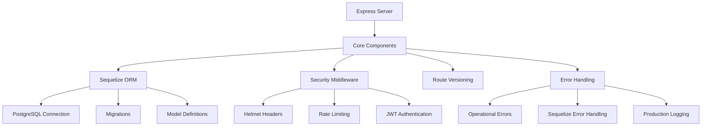

# PupilSync Server Architecture (Updated for PostgreSQL)

## Overview
Production-grade Express.js API server following modern best practices with:
- JWT authentication flow
- PostgreSQL database integration
- Comprehensive security measures
- Automated testing suite



## Package Dependencies

### Runtime Dependencies
| Package | Purpose |
|---------|---------|
| bcryptjs | Password hashing |
| compression | Response compression middleware |
| cookie-parser | Cookie parsing middleware |
| cors | Cross-Origin Resource Sharing middleware |
| dotenv | Environment variable loader |
| express | Web application framework |
| express-rate-limit | Request rate limiting |
| express-validator | Request validation middleware |
| helmet | Security HTTP headers |
| http-status-codes | HTTP status code constants |
| jsonwebtoken | JWT implementation |
| morgan | HTTP request logger |
| passport | Authentication middleware |
| passport-jwt | JWT strategy for Passport |
| pg | PostgreSQL client |
| pg-hstore | PostgreSQL hstore support |
| sequelize | PostgreSQL ORM |
| validator | String validation library |
| winston | Logging library |
| winston-daily-rotate-file | Rotating file transport for Winston |

### Development Dependencies
| Package | Purpose |
|---------|---------|
| cross-env | Cross-platform environment variables |
| jest | Testing framework |
| nodemon | Development server reloading |
| sequelize-cli | Sequelize CLI tools |
| supertest | HTTP assertion testing |

## Testing Strategy
- 100% endpoint coverage
- Database transaction rollbacks
- Security test cases
- Error scenario testing

To run tests:
```bash
npm test